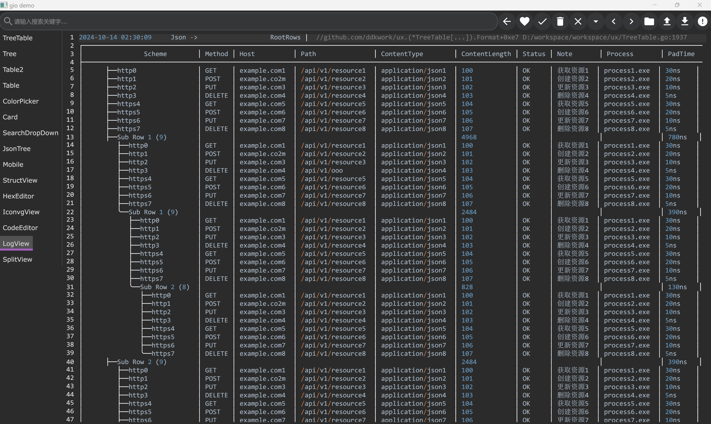
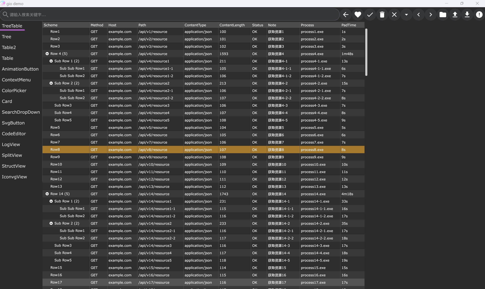
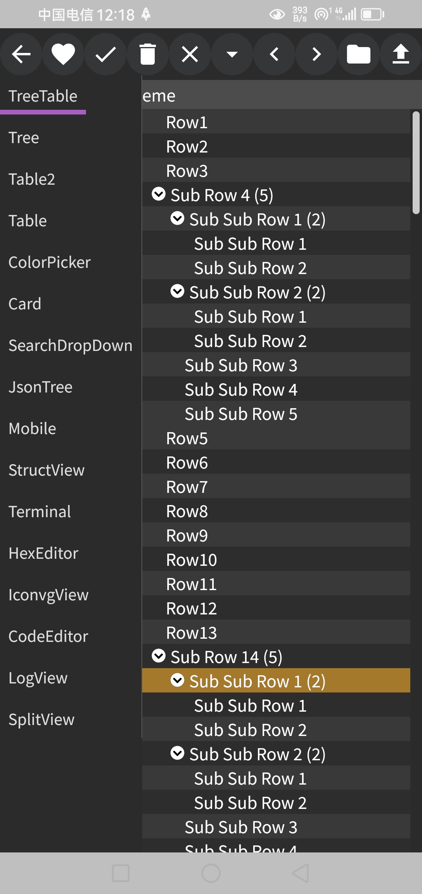
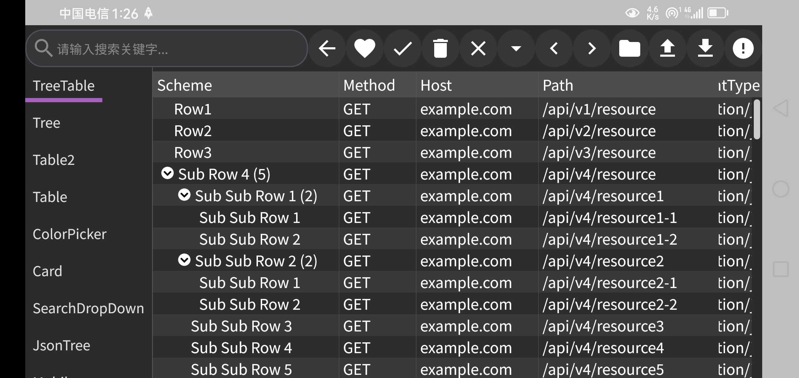

因涉及到一些私有的逆向工程项目引用，即日起不再开源。

gio ux widgets is a go language gui framework based on https://github.com/gioui/gio,
with added features such as treeGrid widget etc.

thanks

| index | repositories                                | feature                       |    | 
|-------|---------------------------------------------|-------------------------------|----| 
| 1     | https://github.com/oligo/gioview            |                               |    | 
| 2     | https://github.com/x-module/gioui-plugins   | some widget                   |    |            
| 3     | https://gitee.com/haodreams/gw              | some widget                   |    |            
| 4     | https://github.com/chapar-rest/chapar       | some widget                   |    |            
| 5     | https://github.com/dominikh/gotraceui       | table resize column from drag |    |            
| 6     | https://github.com/vsariola/sointu          | split layout                  |    |            
| 7     | https://github.com/g45t345rt/g45w           | animation button              |    |            
| 8     | https://github.com/richardwilkes/unison     | naryTree                      |    |            
| 9     | https://github.com/tonyhallett/TreeGrid     | treeTable layout logic        |    | 
| 10    | https://github.com/oligo/gvcode             | code editor                   |    | 
| 11    | https://github.com/mearaj/giowidgets        | resizer and datePicker        |    | 
| 12    | https://github.com/hkontrol/hkapp           | longPress and touch menu      |    | 
| 13    | https://github.com/hd-buddy/Date-Picker-gio |                               |    | 
| 14    | https://github.com/go-gost/gost-plus        | button style                  |    | 

