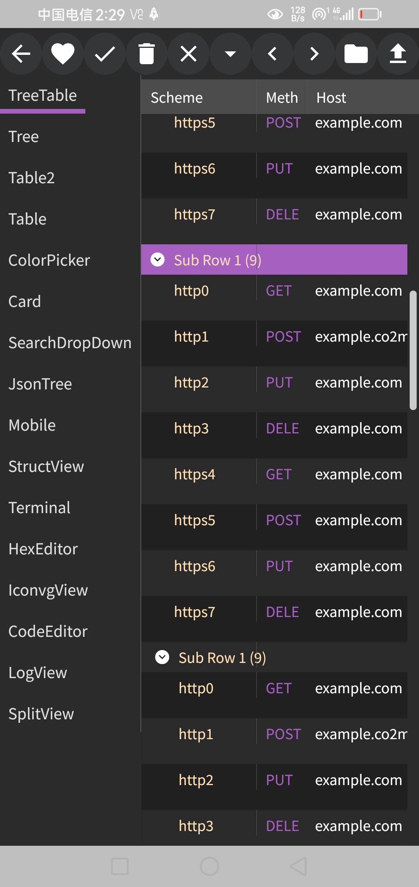

gio ux widgets is a go language gui framework based on https://github.com/gioui/gio, with added features such as tree view, grid view, and mobile support.

thanks
https://github.com/oligo/gioview
https://github.com/x-module/gioui-plugins
https://gitee.com/haodreams/gw
https://github.com/dominikh/gotraceui
https://github.com/vsariola/sointu
https://github.com/richardwilkes/unison
https://github.com/tonyhallett/TreeGrid

Work in progress, call for testing and bug feedback for testing go language gui framework, based on https://github.com/richardwilkes/unison
 made out of personal interest.

