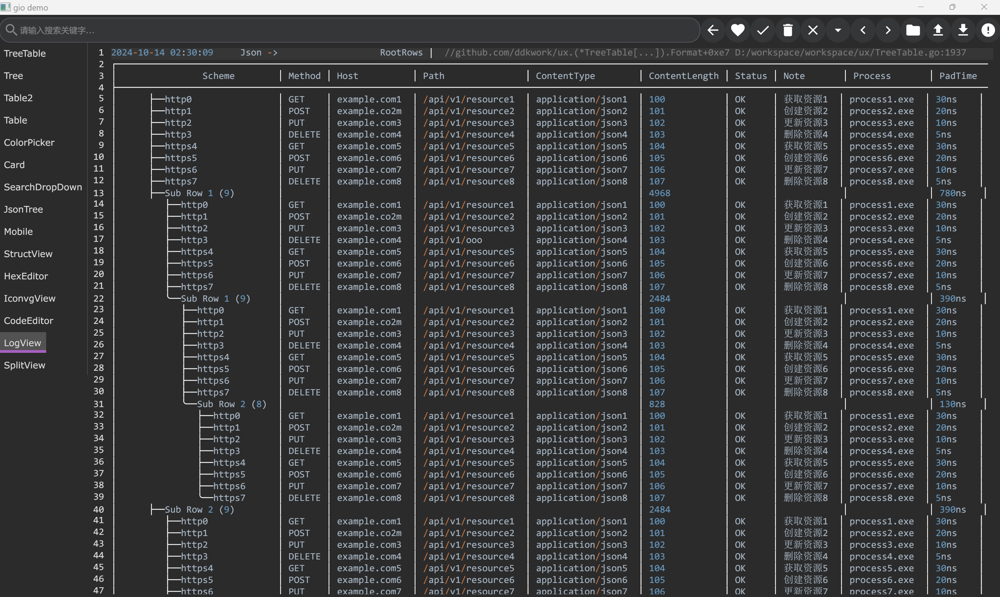
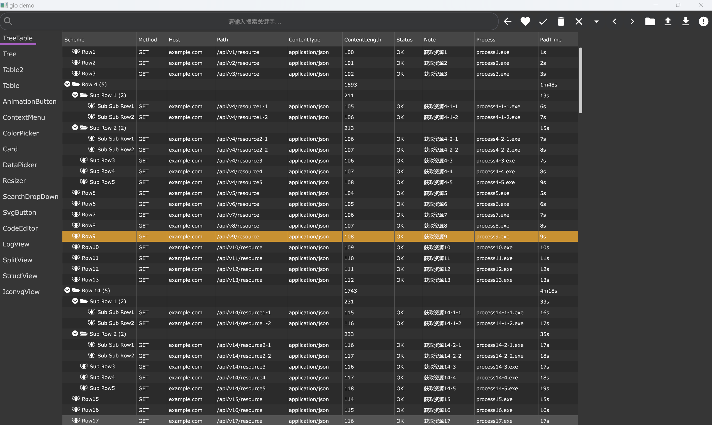
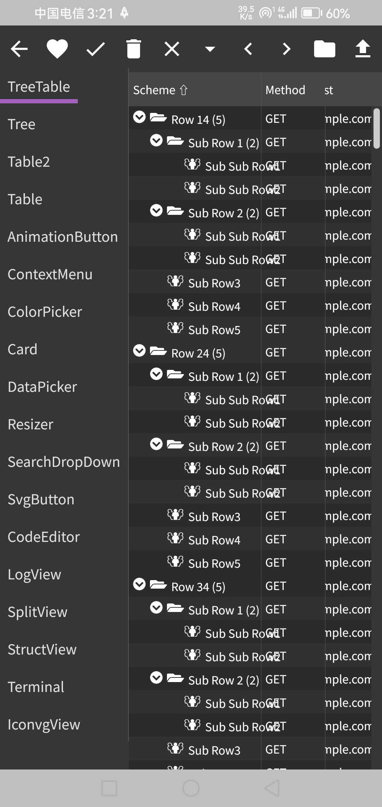
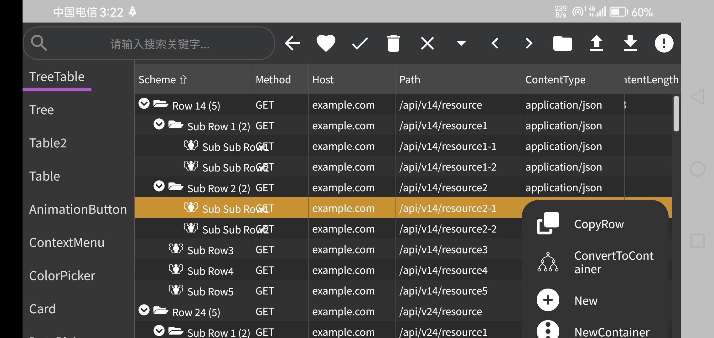

gio ux widgets is a go language gui framework based on https://github.com/gioui/gio,
with added features such as treeGrid widget etc.

thanks

| index | repositories                                | feature                       |    | 
|-------|---------------------------------------------|-------------------------------|----| 
| 1     | https://github.com/oligo/gioview            |                               |    | 
| 2     | https://github.com/x-module/gioui-plugins   | some widget                   |    |            
| 3     | https://gitee.com/haodreams/gw              | some widget                   |    |            
| 4     | https://github.com/chapar-rest/chapar       | some widget                   |    |            
| 5     | https://github.com/dominikh/gotraceui       | table resize column from drag |    |            
| 6     | https://github.com/vsariola/sointu          | split layout                  |    |            
| 7     | https://github.com/g45t345rt/g45w           | animation button              |    |            
| 8     | https://github.com/richardwilkes/unison     | naryTree                      |    |            
| 9     | https://github.com/tonyhallett/TreeGrid     | treeTable layout logic        |    | 
| 10    | https://github.com/oligo/gvcode             | code editor                   |    | 
| 11    | https://github.com/mearaj/giowidgets        | resizer and datePicker        |    | 
| 12    | https://github.com/hkontrol/hkapp           | longPress and touch menu      |    | 
| 13    | https://github.com/hd-buddy/Date-Picker-gio |                               |    | 
| 14    | https://github.com/go-gost/gost-plus        | button style                  |    | 







 30行代码的树形表格实例化模板，todo 集成到ide中，提供模板生成器,暂时保存到goland的代码块模板，命名为tt?
```go
t := ux.NewTreeTable(Godoc{})
t.TableContext = ux.TableContext[Godoc]{
CustomContextMenuItems: func(gtx layout.Context, n *ux.Node[Godoc]) iter.Seq[ux.ContextMenuItem] {
return func(yield func(ux.ContextMenuItem) bool) {

			}
		},
		MarshalRowCells: func(n *ux.Node[Godoc]) (cells []ux.CellData) {

			return ux.MarshalRow(n.Data, func(key string, field any) (value string) {

				return ""
			})
		},
		UnmarshalRowCells: func(n *ux.Node[Godoc], rows []ux.CellData)Godoc {
			return  ux.UnmarshalRow[Godoc](rows, func(key, value string) (field any) {
				return nil
			})
		},
		RowSelectedCallback: func() {

		},
		RowDoubleClickCallback: func() {

		},
		SetRootRowsCallBack: func() {

		},
		JsonName:   "env",
		IsDocument: false,
	}
```